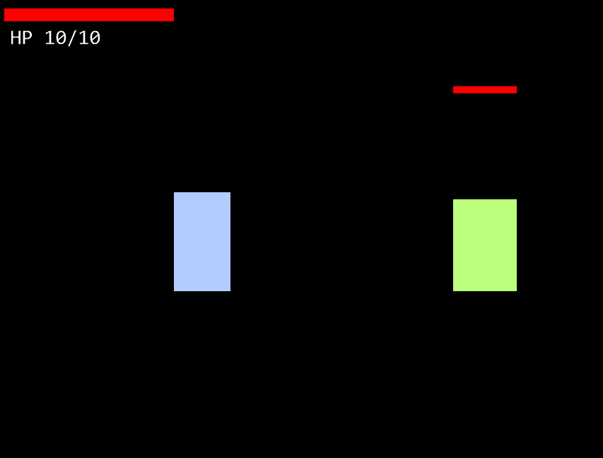
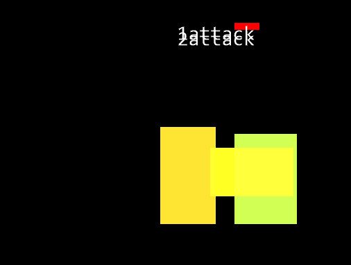
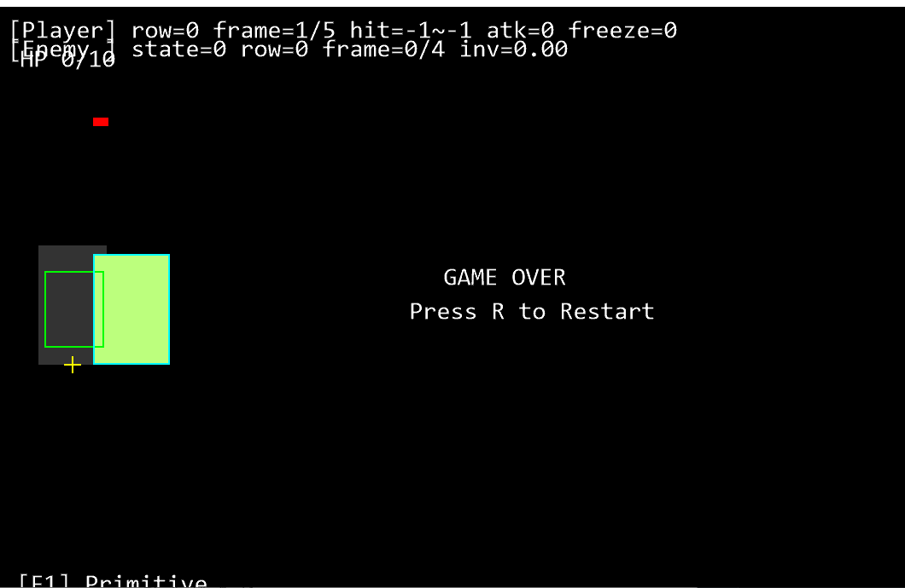

# Content Client Prototype


### 프로젝트 개요
- 횡스크롤 클라이언트 프로토타입 구현
- 단순 렌더링이 아닌 판정, 타이밍, 디버그, 튜닝 중심으로 콘텐츠 제작 친화적인 구조 설계 목표
    - Language: C++ (Win32)
    - Graphics: DirectX 11 / DirectXTK(SpriteBatch)

### 전체 아키텍처 개요
```text
WinMain
 └─ Game
     ├─ Tick()              
     ├─ updatePlayer()
     ├─ updateEnemy()
     ├─ updateFloatingTexts()
     └─ renderFrame()
```
- main -> Game -> SubSystems 형식의 단순화
- main.cpp는 최소화 : 창 생성, 루프, 바인딩 담당
- Game을 오케스트레이터로 사용
    - 로직, 순서, 시간, 디버그 관리
- 실제 구현을 Hooks로 외부 주입하여 결합도를 최소화

### Hooks 기반 설계
- Game이 Player, Enemy, Render, Input을 직접 소유하지 않음
- GameHooks 구조체를 통해 함수 포인터, 상태 포인터 주입
- 목적
    - 기존 코드 리팩토링
    - 한 파일에 모든 로직이 몰려있었음
    - 테스트, 대체 구현 가능성 확보
```cpp
struct GameHooks
{
    // state
    RenderMode* renderMode;
    float* hitStopTimer;
    float* shakeTimer;
    float* timeAcc;

    // input
    bool (*isPressedOnce)(int);

    // update
    void (*updatePlayer)(float);
    void (*updateEnemy)(float);

    // render
    void (*renderFrame)();
};
```
- Game은 Hooks가 누락되면 즉시 return 하며 필요시 로그 남기도록 방어적인 구성 목표

### 시간 관리
- 게임의 시간을 두가지로 나누어 디버깅에 사용
- dtReal / dtGame
- 실제 경과 시간과 게임 로직 시간
- Alt+Tab으로 인한 dt 폭주 방지를 위해 상한도 적용

### 판정 시스템
- BodyBox / HurtBox / HitBox 분리함
- 로컬 좌표 -> 월드 좌표 변환 통일
- 좌우 반전시 좌표 오류 해결 경험을 포함한 시스템 구성
- 특징  
    - 애니메이션 프레임 기반 히트 유효 구간
    - 히트 스턴, 넉백, 카메라 쉐이크 구현
    - 판정 좌표계 통일 후 디버그 시각화

### Data-Driven(ini기반)
- tuning.ini
    - Enemy / Combat / UI / Attack 수치 조정
    - 코드 수정 없이 밸런스 변경 가능(기획자도 가능하도록 목표)
- attacks.ini
    - 공격 정의(프레임, 히트 구간, 체인)
    - 공격 연계 및 실험용 확장 구조

### 구현된 디버그기능
- F1 : RenderMode 전환
    - 현재 의도적으로 비활성화중
    - 코드가 Primitive 기반으로만 강제로 설정
    - RenderMode::SpriteRequested와 SpriteBatch Draw경로 복원이 필요함
- F3 : 애니메이션 Freeze
- F4 : 프레임 Step
- F5 : Debug Overlay
- F6 : 판정 박스 표시
- 디버그 입력은 Game::Tick() 에서만 처리

### 랜더링 의도적 비활성화에 대해
- Primitive 기반 렌더링만 유지
    - 시각 요소 디버그 방해 제거
    - 시각 요소 자원을 구하지 못했음
    - 판정 / 타이밍/ 툴 검증에 집중함
- 랜더링 다시 활성화하는법
    - Game.cpp에서 풀백하는 블록이 있음(제거)
    ```cpp
    if (*hooks_.renderMode == RenderMode::SpriteRequested)
    {
        *hooks_.renderMode = RenderMode::Primitive;
        OutputDebugStringW(L"[Game::Tick] SpriteRequested -> fallback to Primitive\n");
    }
    ```
    - RenderFrame에서 Sprite 경로 분기 추가
    ```cpp
    void RenderFrame()
    {

    if (gRenderMode == RenderMode::SpriteRequested)
    {
        RenderWorldSprite();     
    }
    else
    {
        RenderWorldPrimitive();
    }
    }
    ```
    - Sprite 리소스 로드(텍스처) 복구(main)
    ```cpp
    static Microsoft::WRL::ComPtr<ID3D11ShaderResourceView> gPlayerSheetTex; //추가

    HRESULT hr = DirectX::CreateWICTextureFromFile(
    gDevice.Get(),
    gContext.Get(),
    L"assets\\player_sheet.png",
    nullptr,
    gPlayerSheetTex.ReleaseAndGetAddressOf()
    );

    if (FAILED(hr))
    {
        OutputDebugStringW(L"[Assets] Failed to load player_sheet.png\n");
        gRenderMode = RenderMode::Primitive;
    } // 추가
    ```
    - 이후 랜더 함수 추가하여 사용하면 랜더링 가능함

### 트러블슈팅
- WICTexture 로딩 실패
    - 경로를 따로 처리하는 cpp만들어서 해결함
- SpriteBatch Begin/End
    - UI/텍스트/사각형이 프레임마다 깨져보일때가 있음
    - 랜더 함수에서 호출순서 조정
    - 재발방지로 엔트리 하나만 설정(RenderFrame)
- SourceRect startCol, 칼비침 등 스프라이트 문제
    - 스프라이트보다 완성도있는 디버깅, 세팅을 중요하게 생각
    - 그 부분에 집중해서 스프라이트 포기
- min/max 매크로 충돌
    - 관련 cpp 상단에 #define NOMINMAX 추가 후 include
- 프로젝트 코드 리펙토링 과정에서 에러 폭발함
    - 프로젝트에 포함되지 않았다거나, 정의되지 않은 ODR 위반사례
    - 전역은 헤더 선언, cpp단일 정의 원칙으로 정리
- 흰 화면(렌더가 갑자기 안 나오는 문제)
    - 중괄호 누락으로 Tick()이 종료되는 문제
    - 방어적 return 블록 처리(중괄호 감싸기)

### 실 작동화면
- 초기화면

- 공격시(2단 공격까지 버퍼로 호출)
  
- 사망시 (리스타트 가능)

- 각 프레임별 freeze 재생 기능 등 다양한 기능 포함
- 몬스터는 기본적으로 플레이어를 추적(어그로), 멀어지면 해제